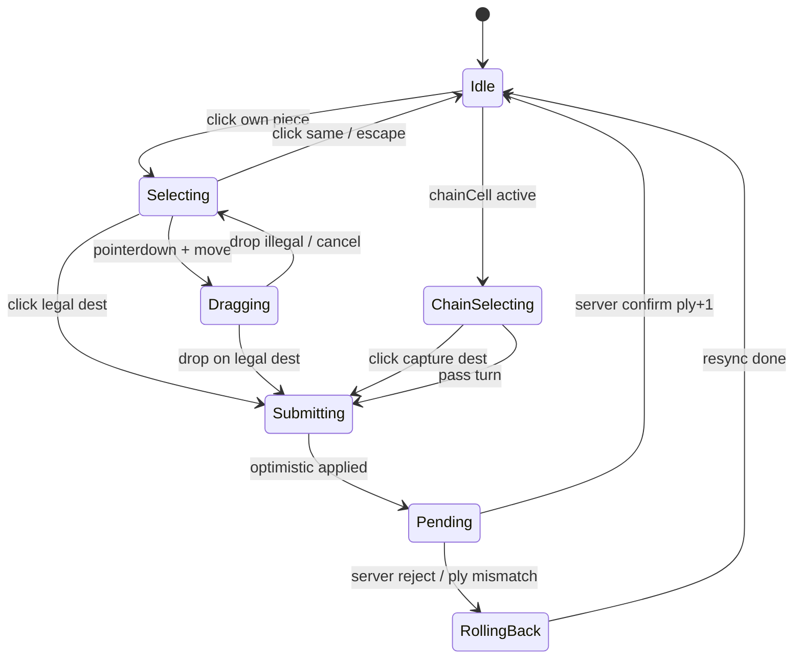

# Shatra Target Architecture V2

> Целевая архитектура уровня Lichess.  
> Ветка: `architecture/lichess-target-v2`  
> Статус: **проектирование** (не реализация)  
> Дата: 2025-06-19  
> Ревизия: **2025-06-19b** — выбран **Вариант F** (Python authoritative + TypeScript client rules)

---

## Оглавление

1. [Сравнение с Lichess](#1-сравнение-с-lichess)
2. [Анализ game_engine](#2-анализ-game_engine)
3. [Local Engine](#3-local-engine)
4. [Shared Engine Strategy](#4-shared-engine-strategy)
5. [Optimistic Architecture](#5-optimistic-architecture)
6. [WebSocket Protocol V2](#6-websocket-protocol-v2)
7. [Delta Synchronization](#7-delta-synchronization)
8. [Performance Model](#8-performance-model)
9. [Scalability](#9-scalability)
10. [Migration Plan](#10-migration-plan)
11. [Final Target Architecture](#11-final-target-architecture)
12. [Критика предположений](#12-критика-предположений)
13. [История ревизий](#история-ревизий)

---

## 1. Сравнение с Lichess

### 1.1 Архитектурные принципы Lichess (глубокий разбор)

Lichess ([lila](https://github.com/lichess-org/lila)) — это **server-authoritative realtime-система** с **автономным клиентом**. Ключевой инвариант: **UI никогда не ждёт сеть для интерактивных действий**.

#### Где находится движок правил

| Слой | Lichess | Роль |
|------|---------|------|
| **Клиент** | [chessops](https://github.com/niklasf/chessops) (TypeScript) | Легальные ходы, валидация, применение хода локально |
| **Сервер** | [scalachess](https://github.com/lichess-org/scalachess) (Scala) | Авторитетная валидация, рейтинг, архив, турниры |
| **Связь** | Общая спецификация + тысячи тестов на идентичность поведения | Не общий бинарник, а **контракт** |

Движок правил **дублируется** (клиент + сервер), но **не дублируется произвольно** — через conformance-тесты.

#### Где считаются легальные ходы

**Только на клиенте** в момент взаимодействия. `chessground` получает `dests: Map<from, to[]>` от chessops **синхронно** при клике/drag. Сервер не участвует.

#### Где считаются подсказки (dests, premoves, analysis arrows)

- **В игре:** клиент (chessops).
- **На сервере:** только для анализа (Stockfish/fishnet), турнирной логики, cheat detection — не для UI latency path.

#### Optimistic UI

```
User drops piece
  → chessground анимирует ход немедленно
  → клиент отправляет { uci } на сервер (fire-and-forget с очередью)
  → сервер валидирует; при ошибке — resync позиции
```

Клиент держит **две версии** состояния:
- **display state** — то, что видит пользователь (включая неподтверждённые ходы);
- **server version** — последний подтверждённый ply/version.

#### Drag-and-drop

`chessground`:
- при `mousedown` — выбор фигуры + мгновенные dests;
- при `drag` — ghost следует за курсором, origin cell пустеет визуально;
- при `drop` на legal dest — анимация + optimistic apply;
- при `drop` на illegal — snap-back без сети.

Сеть не участвует ни на одном этапе до отправки хода.

#### State synchronization

- **Идентификатор версии:** ply number (полуход) + иногда clock version.
- **Нормальный путь:** delta `{ uci, ply, clock }` — не полная позиция.
- **Recovery:** при reconnect — snapshot (FEN + history) один раз, далее deltas.
- **Reconcile:** если `server.ply !== client.confirmedPly` → full resync или rollback optimistic moves.

#### WebSocket protocol

- Минимальные сообщения: ход, часы, статус игры, draw/resign.
- **Нет** hint-request round-trip.
- **Нет** передачи полной доски на каждый ход.
- Broadcast в комнату — только подтверждённые события.

#### Authoritative на сервере

- Текущая позиция (source of truth).
- Часы (с коррекцией по server time).
- Результат партии, рейтинг, архив.
- Очередь ходов, illegal move rejection.
- История для PGN/анализа.

#### Локально на клиенте

- Копия позиции (может опережать сервер на 0–N ply).
- Легальные ходы, выделение, premoves.
- Анимации, звук, UI state.
- Интерполяция часов между server ticks.
- Move list (строится локально, синхронизируется с сервером).

---

### 1.2 Сравнение с текущей Shatra

| Принцип Lichess | Shatra сейчас | Разрыв |
|-----------------|---------------|--------|
| Движок на клиенте | `game_engine` только Python на сервере | **Критический** |
| Легальные ходы локально | WS hint-request → `get_hints()` | **Критический** — RTT на каждый клик |
| Optimistic UI | Доска обновляется только на `MOVE_MADE` | **Критический** |
| Минимальный WS payload | Полная `board` client→server, полный `desk`+`move_history` server→client | **Высокий** |
| Delta sync | Full desk каждый ход | **Высокий** |
| Versioned state | Нет version/ply | **Высокий** |
| Drag без сети | Ghost локальный, позиция — с сервера | **Средний** |
| Часы: local interp | ✅ `useClockCountdown` — уже Lichess-style | Минимальный |
| Server authoritative | ✅ Redis game state, validation | Сохранить |
| Hint stale protection | ✅ `hintMatchesSelection` | Сохранить, станет не нужен для hints |

**Асимметрия Shatra (скрытый баг будущего optimistic UI):**
- Hints считаются по **серверной** доске (`build_hint_event_from_game`).
- Moves применяются к **клиентской** доске (`data["board"]` в `parse_client_event`).

Это нужно устранить в V2: **один источник позиции на сервере**, клиент шлёт только `{from, to, ply}`.

---

## 2. Анализ game_engine

Общий объём: ~1900 строк Python. Движок **stateless** — все данные через параметры. Это идеальная форма для shared engine.

### Таблица модулей

| Модуль | Назначение | Решение | Обоснование |
|--------|-----------|---------|-------------|
| `game_logic.py` | Фасад `handle_event` | **C) Shared** | Единая точка входа; должна жить и на клиенте, и на сервере |
| `models.py` | `GameEvent`, `GameEventResult` | **C) Shared** | Контракт между слоями |
| `board.py` | Представление доски, piece cache | **C) Shared** | Базовая структура данных |
| `domain.py` | `Color`, `PieceType`, parse/format | **C) Shared** | Канонические типы |
| `dictionaries.py` | Статические таблицы ходов (~19 KB) | **C) Shared** | Данные, не код; один источник, сериализуемы в JSON |
| `pieces/base.py` | ABC Piece | **C) Shared** | |
| `pieces/shatra.py` | Логика шатры | **C) Shared** | |
| `pieces/biy.py` | Логика бия | **C) Shared** | |
| `pieces/batyr.py` | Логика батыра | **C) Shared** | |
| `validation.py` | Mandatory capture, validate_move | **C) Shared** | Критично для UI dests |
| `hints.py` | `get_hints` — легальные цели | **C) Shared** | Сейчас server-only — главный bottleneck UI |
| `moves.py` | `process_move`, chain, promotion | **C) Shared** | Optimistic apply на клиенте |
| `endgame.py` | Победа бием, ничья, repetition | **C) Shared** (частично) | Клиент: UI endgame dialog; сервер: финализация |
| `message_codes.py` | Коды ошибок/событий | **C) Shared** | i18n на клиенте по кодам |
| `game_rules.md` | Человекочитаемая спецификация | **C) Shared** | Canonical spec document |
| `словари.py` | Legacy duplicate? | **D) Заменить** | Удалить дубликат, оставить `dictionaries.py` |
| `backend/ai.py` | Minimax/alpha-beta search | **A) Server only** | Тяжёлые вычисления, секретные веса |
| `backend/ai_trained.py` | Веса, глубина поиска | **A) Server only** | |
| `backend/ai_weights.py` | ML weights | **A) Server only** | Не раскрывать клиенту |

### Зависимости backend → game_engine (сохранить)

```
backend/session/messages.py  → logic.handle_event
backend/game_helpers.py      → build_move_response (заменить на V2 builder)
backend/session/ai.py        → logic + ai search
tests/*                      → conformance source
```

---

## 3. Local Engine

Идеальный локальный движок — **полная копия rules layer** из `game_engine`, без AI и без I/O. Выполняется в браузере на main thread (< 1 ms на операцию для 62-клеточной доски).

### Таблица операций

| Операция | Браузер? | Размещение | Причина |
|----------|----------|------------|---------|
| **hints** (legal dests) | ✅ Да | **Дублировать** | Мгновенный UI; сейчас главный RTT |
| **move generation** | ✅ Да | **Дублировать** | Основа dests и premove (будущее) |
| **validation** | ✅ Да | **Дублировать** | Отсечь illegal до отправки; снизить server load |
| **mandatory capture detection** | ✅ Да | **Дублировать** | Подсветка обязательных взятий без сети |
| **chain capture logic** | ✅ Да | **Дублировать** | Цепочки — multi-step UI без hint RTT |
| **endgame detection** | ✅ Да (UI) | **Дублировать** + сервер финализирует | Клиент показывает диалог; сервер пишет в БД |
| **repetition detection** | ⚠️ Частично | **Дублировать** + сервер authoritative | Клиент предупреждает; сервер объявляет ничью |
| **move history processing** | ✅ Да | **Клиент primary**, сервер verify | Локальная история для UI; сервер — архив |
| **captured pieces tracking** | ✅ Да | **Клиент derive** из board | `countPiecesByType(board)` локально |
| **AI support** | ❌ Нет | **Server only** | Поиск, веса, CPU — не в браузере |

### API локального движка (целевой)

```typescript
// packages/shatra-rules — TypeScript (см. раздел 4, Вариант F)
interface ShatraRules {
  getLegalMoves(state: GameState, from: CellId): LegalMove[]
  applyMove(state: GameState, move: Move): ApplyResult
  getHints(state: GameState, from: CellId): HintResult
  isGameOver(state: GameState): GameOverResult
  initialState(setup?: Setup): GameState
}
```

`GameState` включает:
- `board: Map<CellId, Piece>`
- `turn: Color`
- `chainCell: CellId | null`
- `batyrCapturedThisTurn: CellId[]`
- `positionHistory: Map<Hash, number>`
- `movesWithTwoBiys: number`
- `ply: number` — **версия для sync**

---

## 4. Shared Engine Strategy

### Вариант F (рекомендуемый): Python authoritative + TypeScript client rules

Модель **chessops / scalachess** — буквальное следование Lichess.

```
game_rules.md + tests/fixtures/rules/*.json (canonical contract)
        ↓
┌───────────────────┐     ┌────────────────────────────┐
│ game_engine/      │     │ packages/shatra-rules/     │
│ Python (server)   │     │ TypeScript (browser)       │
│ authoritative     │     │ hints · apply · validate   │
└───────────────────┘     └────────────────────────────┘
        ↓                           ↓
   pytest                    vitest (contract suite)
        └───────── CI conformance gate ─────────────┘
```

| Критерий | Оценка |
|----------|--------|
| Производительность | `getHints` < 0.5 ms на 62-клеточной доске — достаточно |
| Поддерживаемость | Два кода; стек команды уже Python + React/TS |
| Риск рассинхрона | Средний-высокий **без** contract tests; низкий **с** contract tests |
| Скорость разработки | **Быстрее** — нет Rust/WASM toolchain |
| Тестирование | JSON fixtures из pytest → vitest |
| Долгосрочность | Проверенная модель Lichess 10+ лет |
| Соответствие Lichess | **Прямое** (chessops = TS, scalachess = другой язык) |
| Объём нового кода | ~1500 LOC TS + ~19 KB данных + contract suite |

**Обязательное условие:** contract suite в CI. Без него F и любой dual-runtime одинаково опасны.

### Вариант B: Общий TypeScript (client + server)

| Критерий | Оценка |
|----------|--------|
| Производительность | Хорошо; Node для server rules |
| Поддерживаемость | Один код правил |
| Риск рассинхрона | **Низкий** для rules |
| Тестирование | Простое |
| Долгосрочность | Потребует Node rules runtime или subprocess в Python backend — **ломает текущий стек** |
| Соответствие Lichess | Да, но Lichess не использует один язык |

**Проблема для Shatra:** backend — FastAPI/Python, AI — Python. Перенос rules в TS означает либо Node sidecar, либо полный rewrite backend rules layer.

### Вариант C: Python в браузере (Pyodide/WASM)

| Критерий | Оценка |
|----------|--------|
| Производительность | **Плохо** — 5–15 MB, cold start 2–5 s |
| Поддерживаемость | Один Python код |
| Риск рассинхрона | Нулевой |
| Тестирование | Простое |
| Долгосрочность | **Не подходит** для mobile и 10k games |
| Соответствие Lichess | **Нет** — Lichess не грузит Scala в браузер |

**Вердикт: отклонить.**

### Вариант D: Rust `shatra-rules` crate → WASM (client) + PyO3 (server)

| Критерий | Оценка |
|----------|--------|
| Производительность | Микросекунды vs доли ms в TS — **не ощущается** на 62 клетках |
| Поддерживаемость | Rust toolchain + bindgen; выше порог входа |
| Риск рассинхрона | Минимальный **только после** миграции сервера на тот же Rust core |
| Скорость разработки | **Медленнее** в 1.5–2× vs TS port |
| Bundle | ~40–80 KB gzip WASM — **не меньше** TS (~25–40 KB) |
| Соответствие Lichess | Принципы да; **форма нет** — Lichess не использует WASM rules |

**Вердикт:** не primary path. Имеет смысл **только** при стратегической замене `game_engine` на Rust и на сервере (PyO3). Не оправдан масштабом 100–10000 игроков — client rules выполняются per-tab, validation на сервере дёшева для Shatra.

### Сравнение F vs Rust/WASM (независимый анализ)

| Критерий | Вариант F (Py + TS) | Rust/WASM |
|----------|---------------------|-----------|
| Объём кода | ~1550 LOC TS, без нового toolchain | ~1700 LOC + wasm glue + Cargo CI |
| Поддержка | Существующий стек | +Rust expertise |
| Drift (при Python server) | Высокий без tests | **Такой же** — два runtime |
| Скорость до instant UI | **1.5–3 недели** до hints | 3–6 недель |
| Client perf @ 100–10k игроков | < 1 ms | < 1 ms — **ничья** |
| Lichess alignment | **Прямое** | Косвенное |

### Выбор для Shatra

> **Вариант F: Python `game_engine` (authoritative) + `packages/shatra-rules` (TypeScript) + contract suite.**

Причины:
1. **Та же модель, что Lichess** — chessops (TS) + scalachess (другой язык), связанные тестами.
2. **Instant UI** достигается **наличием** local engine, не языком — TS достаточно для 62 клеток.
3. **Не ломает** FastAPI, Redis, Python AI.
4. **Быстрее** к production-quality optimistic UI.
5. Python `game_engine` остаётся единственным server rules **навсегда** — это нормально (как scalachess для Lichess).

Rust/WASM — **отложенный опциональный путь** (см. Этап 8b в миграции), не блокер для V2.

---

## 5. Optimistic Architecture

### 5.1 Выбор фигуры

| | Клиент | Сервер |
|---|--------|--------|
| Действие | `select(cell)` → `engine.getHints(state, cell)` → `display.dests` | **Ничего** |
| State | `ui.selected = cell`, `ui.dests = [...]` | — |
| Сеть | **0 round-trip** | — |
| Время | < 16 ms | — |

### 5.2 Drag

| | Клиент | Сервер |
|---|--------|--------|
| `pointerdown` | select + dests (локально) | — |
| `pointermove` | ghost transform (RAF) | — |
| Визуал | origin cell: piece opacity 0 | — |
| Сеть | **0** | — |

### 5.3 Drop

| | Клиент | Сервер |
|---|--------|--------|
| `pointerup` | если dest legal → `optimisticApply(move)` + анимация | — |
| | `sync.send({t:'move', from, to, ply, prevPly})` | validate + persist |
| | `pendingMoves.push(move)` | broadcast `{t:'move', ...}` всем |
| Звук | немедленно (локально) | — |

### 5.4 Chain capture

| | Клиент | Сервер |
|---|--------|--------|
| После capture | `engine.applyMove` → если `chainCell` set | validate same |
| | `ui.dests = engine.getHints(state, chainCell)` **локально** | — |
| | **Убрать** `useEffect` hint WS | — |
| Pass turn | `optimisticApply(pass)` + send | validate |

### 5.5 Reconciliation

```javascript
onServerMove(msg) {
  if (msg.ply === client.confirmedPly + 1) {
    if (matchesOptimistic(msg, pendingMoves[0])) {
      pendingMoves.shift();
      confirmedPly = msg.ply;
      // display already correct — только sync meta (clocks)
    } else {
      // server disagrees with our optimistic move
      rollbackAndApply(msg);
    }
  } else if (msg.ply > client.confirmedPly + 1) {
    // пропущены ходы (spectator lag, reconnect)
    fullResync(msg.snapshot);
  } else {
    // duplicate / stale — ignore
  }
}
```

**Обнаружение рассинхрона:**
- `ply` mismatch;
- `hash(board) !== msg.boardHash` (опционально в V2);
- server `reject` с кодом ошибки.

### 5.6 Rollback

```
1. Отменить все pending optimistic moves
2. Восстановить board из lastConfirmedSnapshot
3. Применить server state (single delta или snapshot)
4. Показать toast с message_code
5. Пересчитать dests если есть selection
```

### 5.7 State Machine



**Состояния sync layer:**

| State | Meaning |
|-------|---------|
| `confirmedPly` | Последний серверный полуход |
| `displayPly` | Может быть `confirmedPly + pending.length` |
| `pendingMoves[]` | Очередь неподтверждённых ходов |
| `syncStatus` | `synced` \| `pending` \| `desynced` |

---

## 6. WebSocket Protocol V2

### 6.1 Принципы

1. Все сообщения имеют `v: 2` и `t` (type).
2. **Никогда** не передавать полную доску в normal path.
3. `ply` — monotonic version number (полуходы).
4. Hints **не существуют** в протоколе.
5. Snapshot только на: join, reconnect, desync recovery.

### 6.2 Client → Server

#### `move` — сделать ход

```json
{
  "v": 2,
  "t": "move",
  "from": 28,
  "to": 35,
  "ply": 42,
  "clientId": "abc123"
}
```

| | |
|---|---|
| Направление | C→S |
| Размер | ~60–80 bytes |
| Назначение | Submit move at expected ply |

`ply` = `confirmedPly + 1` с клиента (ожидаемый); сервер отклоняет если не совпадает.

#### `pass` — пропуск цепочки (бий)

```json
{ "v": 2, "t": "pass", "ply": 43 }
```

~40 bytes.

#### Control messages (сохранить, добавить `v`)

```json
{ "v": 2, "t": "resign" }
{ "v": 2, "t": "offer_draw" }
{ "v": 2, "t": "decline_draw" }
{ "v": 2, "t": "request_rematch" }
{ "v": 2, "t": "chat", "text": "..." }
```

#### `sync` — запрос snapshot (reconnect / desync)

```json
{ "v": 2, "t": "sync", "lastPly": 40 }
```

### 6.3 Server → Client

#### `snapshot` — полное состояние (только join/recovery)

```json
{
  "v": 2,
  "t": "snapshot",
  "ply": 42,
  "turn": "белый",
  "board": { "1": null, "28": "белая шатра", "...": "..." },
  "chainCell": null,
  "batyrCaptured": [],
  "moveHistory": [{ "ply": 1, "from": 5, "to": 9, "mover": "черный" }],
  "clocks": { "белый": 298.5, "черный": 300.0 },
  "timeControl": 300,
  "increment": 3,
  "yourColor": "белый",
  "gameOver": null
}
```

| | |
|---|---|
| Размер | 1–4 KB (один раз) |
| Назначение | Recovery |

#### `move` — подтверждённый ход (delta)

```json
{
  "v": 2,
  "t": "move",
  "ply": 43,
  "from": 28,
  "to": 35,
  "turn": "черный",
  "captured": [21],
  "promoted": false,
  "chainCell": null,
  "messageCode": "move.ok",
  "clocks": { "белый": 295.2, "черный": 300.0 }
}
```

| | |
|---|---|
| Размер | ~150–250 bytes |
| Частота | 1× на полуход |
| Назначение | Confirm + opponent broadcast |

**Убрано из delta:** `desk`, `move_history`, `essential_positions`.

#### `reject` — отклонение хода

```json
{
  "v": 2,
  "t": "reject",
  "ply": 43,
  "code": "move.impossible",
  "snapshot": { "...": "..." }
}
```

Сервер **всегда** присылает snapshot при reject (для однозначного recovery).

#### `clock` — синхронизация часов

```json
{
  "v": 2,
  "t": "clock",
  "clocks": { "белый": 290.0, "черный": 300.0 },
  "turn": "белый",
  "serverTime": 1718800000123
}
```

~100 bytes, каждые 1 s (или 250 ms для bullet).

#### `gameOver`

```json
{
  "v": 2,
  "t": "gameOver",
  "reason": "biy_wins",
  "winner": "белый",
  "ply": 87
}
```

### 6.4 Что удалить из V1

| V1 | Причина удаления |
|----|------------------|
| `{ position: "positionN" }` hint request | Локальный engine |
| `board` в move payload C→S | Сервер читает Redis |
| `desk` в каждом move response | Delta достаточно |
| `move_history` в каждом response | Только в snapshot; клиент строит локально |
| `essential_positions` в response | Локальный engine |
| `movers_color` в client payload | Сервер знает из game state |
| `position_for_mandatory_capture` C→S | Сервер знает из game state |

### 6.5 Версионирование протокола

- WS endpoint: `/ws/v2/{roomId}` (параллельно с v1 на время миграции).
- Клиент шлёт `{"v":2}` в первом сообщении или через query `?proto=2`.
- Сервер route по версии.

---

## 7. Delta Synchronization

### Можно ли отказаться от полной доски?

**Да**, после join/recovery. Lichess так и работает (UCI moves + rare FEN).

### Система версий

```
ply: uint32        — монотонный счётчик полуходов (начинается с 0)
gameId: uuid       — идентификатор партии
stateHash: uint64  — опционально, xxhash(board + meta) для быстрой проверки
```

### Move ID

Каждый применённый ход: `ply` = previous + 1.  
Клиент отправляет move с `ply = confirmedPly + 1`.  
Сервер:
- если `client.ply !== game.ply + 1` → `reject` + snapshot;
- если move illegal → `reject` + snapshot;
- иначе → apply, increment ply, broadcast delta.

### Reconcile

```
onMessage(msg):
  switch msg.t:
    case 'move':
      if msg.ply == confirmedPly + 1:
        applyDelta(msg)
        confirmedPly = msg.ply
      elif msg.ply > confirmedPly + 1:
        requestSync()
      else:
        ignore stale
    case 'snapshot':
      replaceState(msg)
      confirmedPly = msg.ply
      clearPending()
```

### Resync

Триггеры:
- reconnect (WS open → send `sync`);
- `reject` от сервера;
- `ply` gap detected;
- `stateHash` mismatch (если включён).

### Snapshot recovery

```
Client                              Server
  |─── sync { lastPly: 40 } ───────>|
  |<── snapshot { ply: 42, ... } ───|
  |     replace local state          |
  |     clear pending                |
```

### Архитектура уровня Lichess

```
┌─────────────────────────────────────────────────────────┐
│                     Browser                              │
│  ┌─────────────┐   ┌──────────────┐   ┌───────────────┐ │
│  │ Board UI    │◄──│ Display State│◄──│ Rules (TS)    │ │
│  └─────────────┘   └──────┬───────┘   └───────────────│ │
│                           │                            │ │
│                    ┌──────▼───────┐                    │ │
│                    │  Sync Layer  │                    │ │
│                    │ ply, pending │                    │ │
│                    └──────┬───────┘                    │ │
└───────────────────────────┼────────────────────────────┘ │
                            │ WS v2 deltas                 │
┌───────────────────────────▼────────────────────────────┐ │
│                      Server                             │ │
│  ┌──────────────┐  ┌─────────────┐  ┌───────────────┐  │ │
│  │ WS Handler   │─►│ Game Actor  │─►│ game_engine   │  │ │
│  │ v2 protocol  │  │ per room    │  │ (Python, auth)│  │ │
│  └──────────────┘  └──────┬──────┘  └───────────────┘  │ │
│                           │                             │ │
│                    ┌──────▼──────┐                      │ │
│                    │ Redis game  │                      │ │
│                    │ ply, board  │                      │ │
│                    └──────┬──────┘                      │ │
│                    ┌──────▼──────┐                      │ │
│                    │ PostgreSQL  │                      │ │
│                    │ archive     │                      │ │
│                    └─────────────┘                      │ │
└─────────────────────────────────────────────────────────┘
```

---

## 8. Performance Model

Оценка **односторонней** задержки (RTT ≈ 2×). Субъективные ощущения.

### Выбор фигуры

| Latency | Текущая | Целевая |
|---------|---------|---------|
| 50 ms | ~100 ms без точек; терпимо | **Мгновенно** |
| 100 ms | ~200 ms «пустая» доска | **Мгновенно** |
| 300 ms | ~600 ms; раздражает | **Мгновенно** |
| 500 ms | ~1 с; кажется сломанным | **Мгновенно** |
| 1000 ms | ~2 с; неиграбельно | **Мгновенно** |

### Ход (click/drop)

| Latency | Текущая | Целевая |
|---------|---------|---------|
| 50 ms | ~100 ms фигура «прыгает» | Фигура едет сразу; 100 ms незаметны |
| 100 ms | Заметная пауза | Мгновенно |
| 300 ms | Долго | Мгновенно |
| 500 ms | Очень долго | Мгновенно |
| 1000 ms | Непригодно | Мгновенно; sync в фоне |

### Chain capture (2 шага)

| Latency | Текущая | Целевая |
|---------|---------|---------|
| 500 ms | ~2 s (move + hint) | ~0 ms UI; 1 s фоновый sync |
| 1000 ms | ~4 s | ~0 ms UI |

### Ход соперника

| Latency | Текущая | Целевая |
|---------|---------|---------|
| 500 ms | 500 ms до появления | 500 ms (неизбежно), но с анимацией входа |
| 1000 ms | 1 s | 1 s, но без блокировки своего UI |

### Часы

| | Текущая | Целевая |
|---|---------|---------|
| | Уже плавные между ticks | + serverTime для drift correction |

---

## 9. Scalability

### Модель нагрузки (после V2)

Допущения: средняя партия 40 полуходов, 2 WS на игрока, 1 move delta = 200 bytes.

| Партий | WS connections | Move msgs/s (avg) | Traffic moves/s | Redis ops/s |
|--------|----------------|-----------------|-----------------|-------------|
| 100 | 200 | ~1.3 | ~260 B/s | ~5 |
| 1,000 | 2,000 | ~13 | ~2.6 KB/s | ~50 |
| 10,000 | 20,000 | ~130 | ~26 KB/s | ~500 |

**Сравнение с V1 при 10k партий:**
- V1 move payload ~1.5 KB × 2 (C→S + S→C) × 130/s ≈ **390 KB/s** только ходы
- V2 ~200 B × 2 × 130/s ≈ **52 KB/s** — **~7.5× меньше**

### Новые узкие места (не старые)

| Узел | Риск | Митигация |
|------|------|-----------|
| **WS layer** | 20k connections | Горизонтальное масштабирование; sticky sessions; отдельный WS сервер (как lila-ws) |
| **Redis** | 500 ops/s — легко | Room lock остаётся; sharding по room_id при росте |
| **Game actor lock** | Сериализация per room | Правильно; не bottleneck до 100k rooms |
| **PostgreSQL** | Запись архива | Async write после gameOver |
| **AI CPU** | Отдельный пул | Уже executor; не на hot path PvP |

### Что **улучшится**

- CPU на hint handling: **−100%** (hints удалены из WS).
- JSON parse больших desk: **−95%**.
- Bandwidth: **−80–90%** на move path.

### Рекомендация для 10k+ партий (Lichess-style evolution)

```
Phase scaling:
  1. Single FastAPI + Redis (до ~2k concurrent)
  2. Dedicated WS nodes + Redis pub/sub (2k–20k)
  3. Game room actors sharded (20k+)
```

---

## 10. Migration Plan

Каждый этап — рабочий продукт. V1 и V2 coexist.

### Этап 0: Подготовка (текущая ветка)

| | |
|---|---|
| **Цель** | Зафиксировать целевую архитектуру |
| **Изменения** | `docs/architecture/TARGET_ARCHITECTURE_V2.md`, contract test plan |
| **Риск** | Нет |
| **Эффект** | Общее понимание |

### Этап 1: Contract Suite ✅

| | |
|---|---|
| **Цель** | Единый эталон поведения rules |
| **Изменения** | `scripts/export_rules_contract.py`; `tests/fixtures/rules/contract.json`; `tests/test_rules_contract.py` |
| **Риск** | Низкий |
| **Эффект** | Основа для client engine |

### Этап 2: TypeScript Client Rules (`packages/shatra-rules`) ✅

| | |
|---|---|
| **Цель** | Локальные hints без WS |
| **Изменения** | `frontend/packages/shatra-rules/`; `computeLocalHints`; `useCellClick` без hint WS; chain hints локально в `Game.jsx` |
| **Риск** | Средний — расхождение rules; снижается contract suite |
| **Эффект** | **−50% round-trips** на выбор фигуры и chain refresh |

### Этап 3: Optimistic Moves (V1 protocol) ✅

| | |
|---|---|
| **Цель** | Мгновенный ход без смены протокола |
| **Изменения** | `processMove` в `packages/shatra-rules`; `OPTIMISTIC_MOVE` / `ROLLBACK_OPTIMISTIC`; `applyLocalMove`; rollback on WS error; `pendingMove` guard (chain продолжается); V1 WS payload по-прежнему с pre-move `board` |
| **Риск** | Средний |
| **Эффект** | Мгновенные ходы при любой latency |

### Этап 4: WS Protocol V2 (parallel endpoint) ✅

| | |
|---|---|
| **Цель** | Минимальный трафик |
| **Изменения** | `/ws/v2/{room_id}/`; `backend/session/v2/`; delta move responses; C→S `{from,to,ply}` без board; `ply` в Redis; клиент `?proto=2`; dual broadcast v1+v2 |
| **Риск** | Средний |
| **Эффект** | −80% bandwidth на ход; server CPU −30% (меньше parse board) |

Клиент: feature flag `?proto=2`. V1 endpoint `/ws/` без изменений для старых клиентов.

### Этап 5: Delta-only Server Responses ✅

| | |
|---|---|
| **Цель** | Убрать full desk из normal path |
| **Изменения** | `build_move_delta_response` (V1); snapshot (`desk` + `move_history`) только на join/sync/hints; клиент `resolveBoardFromPayload` + локальная история |
| **Риск** | Средний |
| **Эффект** | Быстрый parse; меньше GC в браузере |

### Этап 6: Ply Versioning + Reconcile ✅

| | |
|---|---|
| **Цель** | Надёжный optimistic при PvP |
| **Изменения** | `ply` в Redis game; sync layer; desync recovery |
| **Риск** | Средний-высокий |
| **Эффект** | Корректность при 500–1000 ms |

### Этап 7: Board Interaction V2 ✅

| | |
|---|---|
| **Цель** | Lichess-level drag |
| **Изменения** | Slide animation; merge ghost→cell; chain UX без auto-hint WS |
| **Риск** | Низкий |
| **Эффект** | Воспринимаемое качество |

Клиент: `board/slideAnimation.js`, `usePieceSlideOverlay`, drag RAF + slide-to-cell / snap-back в `useBoardInteraction`; DOM (`BoardGrid`) и canvas (`CanvasBoard`) с drag; анимация по `lastMove` для клика и ходов соперника. Chain hints — локально в `Game.jsx` (без hint WS).

### Этап 8: V1 Deprecation ✅

| | |
|---|---|
| **Цель** | Убрать legacy protocol |
| **Изменения** | Удалить hint WS, full desk path, `buildHintPayload` |
| **Риск** | Низкий при 100% v2 traffic |
| **Эффект** | Простота кодовой базы |

Клиент: WS v2 only (`/ws/v2/`). Сервер: удалён legacy endpoint `/ws/`, dual broadcast и hint WS; `broadcast_move` шлёт только v2 delta.

### Этап 8b (опционально, не в scope V2): Rust rules convergence

| | |
|---|---|
| **Цель** | Единый binary rules server+client |
| **Изменения** | Rust crate; WASM client **или** PyO3 server; deprecate TS port |
| **Риск** | Высокий |
| **Эффект** | Нулевой drift — **только** если команда готова к Rust и server migration |

**Не требуется** для instant UI, WS v2 или 10k партий. Рассматривать только при явной потребности в single-source rules.

### Этап 9: WS Scaling Layer (при необходимости)

| | |
|---|---|
| **Цель** | 10k+ concurrent |
| **Изменения** | Отдельный WS процесс; Redis pub/sub; presence routing |
| **Риск** | Высокий (инфра) |
| **Эффект** | Горизонтальное масштабирование |

---

## 11. Final Target Architecture

```
┌──────────────────────────────────────────────────────────────────┐
│                         CLIENT (Browser)                          │
│                                                                   │
│  ┌──────────────┐    ┌─────────────────┐    ┌────────────────┐  │
│  │  Board UI    │◄───│  Display State  │◄───│ Animation Layer│  │
│  │  Canvas/DOM  │    │  React reducer  │    │ slide, ghost   │  │
│  └──────┬───────┘    └────────┬────────┘    └────────────────┘  │
│         │                       │                                  │
│         │              ┌────────▼────────┐                        │
│         │              │   Sync Layer    │                        │
│         │              │ ply, pending,   │                        │
│         │              │ reconcile       │                        │
│         │              └────────┬────────┘                        │
│         │                       │                                  │
│         │              ┌────────▼────────┐                        │
│         └──────────────│  Local Engine   │                        │
│                        │  packages/      │                        │
│                        │  shatra-rules   │                        │
│                        │  (TypeScript)   │                        │
│                        │  hints, apply,  │                        │
│                        │  validate       │                        │
│                        └────────┬────────┘                        │
└─────────────────────────────────┼──────────────────────────────────┘
                                  │ WebSocket V2
                                  │ {t:move, from, to, ply}
                                  │ {t:move, delta...} (S→C)
                                  │ {t:snapshot} (recovery only)
┌─────────────────────────────────▼──────────────────────────────────┐
│                           SERVER                                      │
│                                                                       │
│  ┌──────────────┐    ┌─────────────────┐    ┌────────────────────┐   │
│  │ WS Gateway   │───►│ Room Actor      │───►│ game_engine    │   │
│  │ v2 protocol  │    │ lock per room   │    │ (Python, auth) │   │
│  └──────────────┘    └────────┬────────┘    └────────────────┘   │
│                      ┌────────▼────────┐                               │
│                      │ Redis State   │                               │
│                      │ ply, board,   │                               │
│                      │ clocks, meta  │                               │
│                      └────────┬────────┘                               │
│                      ┌────────▼────────┐    ┌────────────────────┐   │
│                      │ Timer Service   │    │ AI Worker Pool     │   │
│                      │ clock ticks     │    │ (Python, server    │   │
│                      └─────────────────┘    │  only)             │   │
│                                             └────────────────────┘   │
│                      ┌─────────────────────────────────────────┐     │
│                      │ PostgreSQL — archive, ratings, users    │     │
│                      └─────────────────────────────────────────┘     │
└──────────────────────────────────────────────────────────────────────┘
```

### Почему это максимально близко к Lichess

| Lichess | Shatra V2 |
|---------|-----------|
| chessops (TS client rules) | `packages/shatra-rules` (TS client rules) |
| scalachess (server rules) | `game_engine` (Python, authoritative) |
| chessground (instant UI) | Display State + Animation Layer |
| UCI move over WS | `{from, to, ply}` delta |
| FEN on reconnect | `snapshot` on reconnect |
| Optimistic move | pending queue + reconcile |
| Server clocks | clock ticks + local interp (уже есть) |
| AI on server | backend/ai.py (без изменений принципа) |
| Conformance tests | pytest fixtures → vitest |

### Что сознательно отличается от Lichess

- **62-клеточная нестандартная доска** — нет готового chessground; свой Canvas/DOM board (уже есть).
- **Chain capture + pass turn** — сложнее chess; optimistic layer должен знать chain state (у Shatra уже есть `posForMandatoryCapture`).
- **Нет premove** в V2 scope — можно добавить позже поверх local engine.
- **Нет Fishnet/анализа** — не нужен для parity; опционально в будущем.

---

## 12. Критика предположений

### «TypeScript engine — временный костыль» — **ошибка**

Lichess **намеренно** держит chessops (TypeScript) на клиенте и scalachess (Scala) на сервере десятилетие. Это не костыль, а **архитектурный паттерн**. Для Shatra Вариант F — не уступка, а **прямое следование Lichess**.

### «Rust/WASM быстрее — значит лучше» — **ошибка для Shatra**

На 62-клеточной доске `getHints` в TS занимает < 0.5 ms. Rust/WASM не даёт ощутимого выигрыша ни при 100, ни при 10 000 игроков. Client rules выполняются per-tab; масштаб игроков не влияет на latency одного `getHints`. Rust оправдан только при стратегии **замены server `game_engine`** на тот же Rust core — отдельное решение, не следствие instant UI.

### «Pyodide = один Python код» — ловушка

Технически верно, практически убивает mobile UX и cold start. Lichess никогда не грузит Scala в браузер.

### «Убрать server validation» — опасно

Optimistic UI **требует** server authoritative. Клиент не заменяет сервер.

### «Полная доска в move payload = security» — ошибка

Сейчас клиент шлёт board, сервер применяет к **клиентской** копии — это **слабее**, чем server-only board + ply check.

### «Копировать chessground» — не подходит напрямую

Chessground заточен под 8×8 grid. Shatra имеет крепости, 62 клетки, нестандартную геометрию. Копировать API chessground бессмысленно; копировать **принципы** (instant dests, optimistic, animation) — правильно.

### «Hint WS нужен для anti-cheat» — слабый аргумент

Lichess не проверяет legality через server hints. Cheat detection — отдельный слой. Shatra не нужны server hints для честности.

### «AI должен быть в браузере» — нет

Lichess держит Stockfish на сервере. Shatra AI — строго server-side.

### «Один язык rules для всего» — не цель и не модель Lichess

Lichess: Scala + TypeScript + Rust (fishnet). Shatra V2: **Python (server rules) + TypeScript (client rules) + React** — корректная аналогия.

### «Без contract tests можно портировать rules» — опасно

При любом dual-runtime (F или Rust) **contract suite обязателен**. Иначе drift неизбежен при первом же изменении правил.

### Где Lichess НЕ подходит для Shatra

1. **Турнирная/лига инфраструктура** — out of scope, не копировать.
2. **PGN/FEN** — у Shatra свой формат; нужен `Shatra Position Notation` (SPN), не FEN.
3. **Premove** — в шахматах критичен на 1+0; в Shatra с chain capture premove сложнее — отложить.
4. **Correspondence chess** — другой sync model; не приоритет.

---

## Финальный ответ

> **Если бы я сегодня создавал Shatra с нуля, имея текущие знания о проекте и ориентируясь на архитектуру Lichess, я бы построил систему следующим образом:**
>
> **Клиент** — React UI с board renderer (Canvas/DOM), полностью автономным в интерактиве. Логика правил — в **`packages/shatra-rules` (TypeScript)**: hints, move generation, validation, chain capture. Это прямая аналогия **chessops**. Отладка в DevTools, нулевой WASM overhead, интеграция с существующим Vite/vitest стеком.
>
> **Сервер** — Python **`game_engine`** как единственный authoritative rules runtime (аналог **scalachess**). FastAPI + per-room actor + Redis lock. Source of truth: `ply`, `board`, `chainCell`, `clocks`. AI — отдельный Python worker pool, не на hot path PvP.
>
> **Связь client ↔ server** — не надежда на идентичность кода, а **contract suite**: pytest экспортирует JSON fixtures → vitest проверяет TS engine в CI на каждый PR.
>
> **Sync layer** — `confirmedPly`, `displayState`, `pendingMoves[]`. Выбор, подсветка, drag, drop, chain — **ноль round-trip**. WS v2: `{from, to, ply}` (~70 B) вверх, delta (~200 B) вниз, `snapshot` только на join/desync.
>
> **Миграция** — contract suite → TS local hints → optimistic UI → WS v2 → delta-only → deprecate v1. Rust/WASM — **не в scope**, опционально только при явной потребности в single-source server rules.
>
> Это не копия Lichess. Это **те же инварианты** теми же средствами, что Lichess использует на практике: TypeScript rules в браузере, другой язык на сервере, conformance tests между ними.

---

## История ревизий

| Дата | Изменение |
|------|-----------|
| 2025-06-19 | Первая версия; primary: Rust/WASM |
| 2025-06-19b | Пересмотр: **Вариант F (Python + TS)** как primary; Rust/WASM → опциональный Этап 8b |

---

## Связанные документы

- [Текущий аудит (предыдущий анализ)](../..) — см. историю чата
- `game_engine/game_rules.md` — human spec
- Ветка реализации: `architecture/lichess-target-v2`
